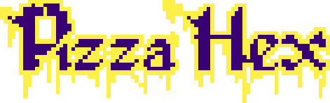
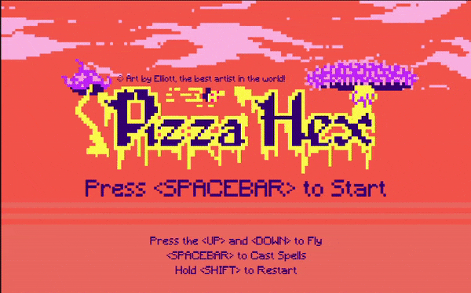

# Pizza Hex

#### A 16-bit Shoot ‘em Up arcade game made with the Phaser JavaScript Framework

Play the [Demo here](https://ghost-goblin.github.io/pizza-hex/)

***

# 🧙‍♀️ How to Play?

+ Hit the **UP** and **DOWN** keys to fly up and down 🧹
+ **SPACEBAR** to conjure **Pizzamancy** and fire your pizza spells 🍕
+ **SHIFT** to restart the game 🕹️
+ Do **NOT** get hit by the goblins or you're dead! ☠️

***

- Artwork by [Elliott Van Tonder](https://www.behance.net/elliebeans6c58)
- Listen to the 🎵🎵🎵[Official Soundtrack](https://soundcloud.com/ghost_goblin/pizza-hex)🎵🎵🎵
